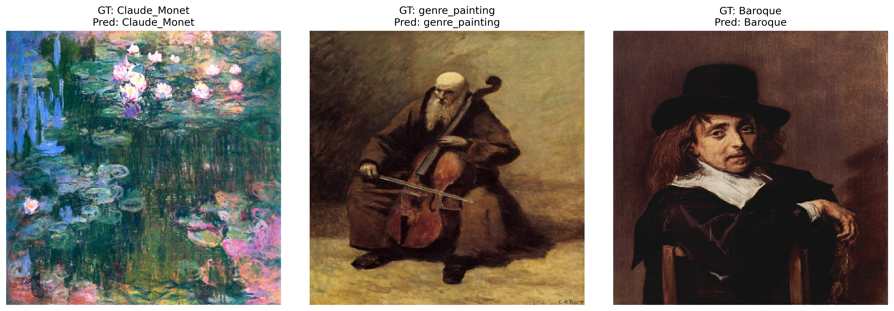
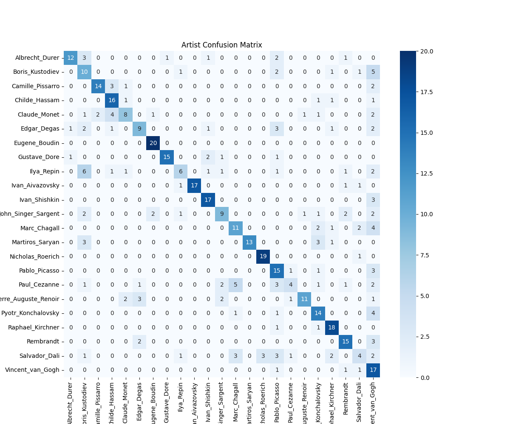
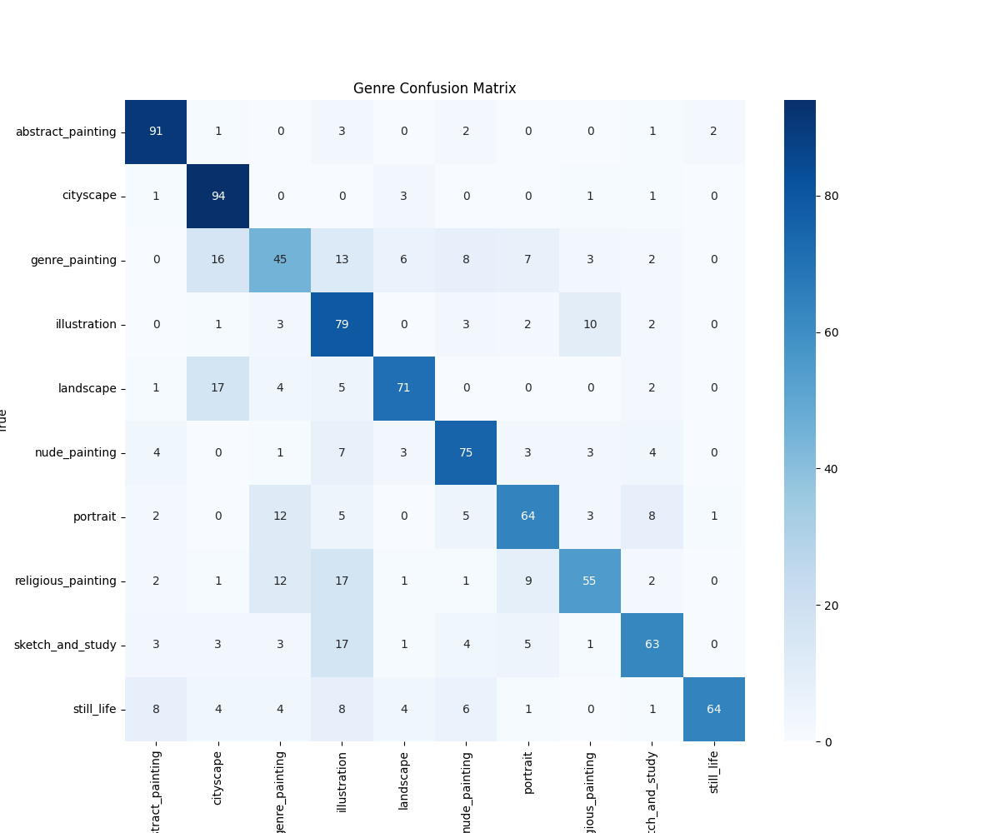
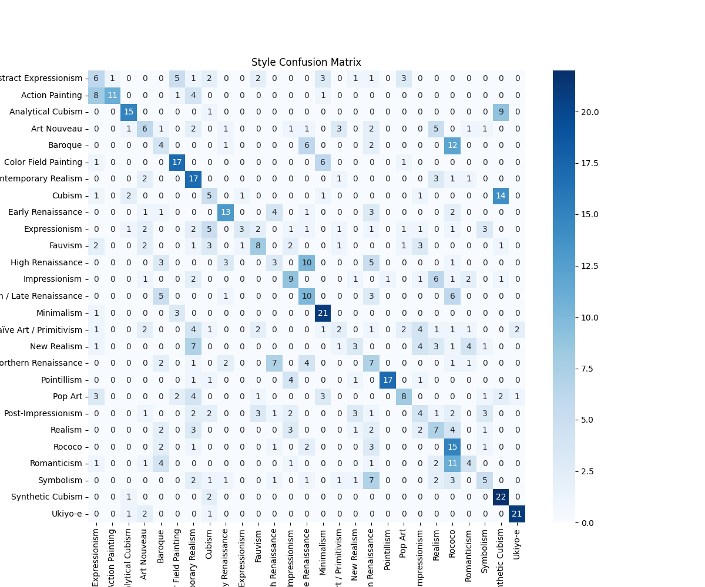

# Task 1: Convolutional-Recurrent Architectures

## Discussion
The dataset presents a challenge in arranging proper temporal data, as year information is available for only a subset of images while missing for many others. This limitation prevents direct chronological modeling. Additionally, the dataset consists of high-quality paintings, where capturing texture and brushstroke patterns is crucial for classification.

To extract meaningful features, a Gabor filter was applied to emphasize texture-based details. Furthermore, a pretrained ConvNeXt model (trained on ImageNet) was utilized to extract deep feature representations from the paintings. These extracted features were then structured into sequences and passed to a CNN-RNN model designed in the `utils` module.

Data augmentation techniques such as MixUp, jittering, and contrast adjustments were not applied. Since paintings are original artworks, applying such augmentations could alter the perspective and artistic intent, leading to misleading training signals. Instead of augmentation, class imbalance was handled using a weighted class approach for style classification.

## Implementation
1. **Dataset Preparation:**
   - Due to hardware limitations, a balanced mini dataset was selected for training instead of using the entire dataset.
   - For artist classification: A total of **6900 images** were used.
   - For genre classification: A total of **10000 images** were used.
   - For style classification: A total of **1400 images** were used.
   - The dataset was created using the `CreateDataset` utility, ensuring proper file structure and format.

   ```python
   csv_file = "/path/to/style_train.csv"
   root_directory = "/path/to/wikiart"
   new_dataset_directory = "/path/to/dataset"
   
   df = pd.read_csv(csv_file, header=None, names=["image_path", "class_label"])
   formatted_csv_file = "/path/to/formatted_style_train.csv"
   df.to_csv(formatted_csv_file, index=False)
   
   create_dataset = CreateDataset(
       csv_file=formatted_csv_file,
       root_directory=root_directory,
       new_dataset_directory=new_dataset_directory,
       image_col="image_path",
       class_col="class_label",
       buffer_size=600,
       num_classes=28,
       name="style"
   )
   create_dataset.create()
   ```

   **Note:** For style classification, the `train.py` and `trainer` files were modified to accept class weights to handle class imbalance effectively.

2. **Data Preparation:**
   - Once the dataset was created, the `prepare_data` module was used to preprocess the images and prepare them for training.

3. **Model Training:**
   - The `train.py` script from the repository was used to train the model.
   - The CNN-RNN architecture from the `utils` module was utilized as the model.
   - The training pipeline was executed with necessary configurations.

4. **Evaluation Data Preparation:**
   - An evaluation dataset was created from the `eval.csv` file by randomly selecting samples per class:
     - **Artist classification:** 20 samples per class.
     - **Genre classification:** 100 samples per class.
     - **Style classification:** 25 samples per class.
   - The evaluation dataset was created using `CreateEvalDataset` utility.

   ```python
   csv_file = "/path/to/style_val.csv"
   root_directory = "/path/to/wikiart"
   eval_data_directory = "/path/to/eval_data"

   create_dataset = CreateEvalDataset(
       root_directory,
       eval_data_directory,
       min_samples_per_class=25,
       max_total_samples=675,
       folder_name="style"
   )
   create_dataset.create(csv_file=csv_file, image_col="image_path", class_col="class_label")
   ```

5. **Model Evaluation:**
   - The evaluation of all three models (Artist, Genre, Style) was performed in the `evaluation.ipynb` file.
   - Metrics were computed, and visualizations were generated to analyze the model performance.

## How to Test the Model

To test the model on new images, follow these steps:

1. **Set Up the Environment**  
   Follow the environment setup instructions provided in the root `README.md` file.

2. **Open Task 1 Directory**  
   Navigate to the `task1` folder and open Jupyter Notebook.

3. **Run the Tutorial Notebook**  
   Open the `tutorial.ipynb` notebook and execute the cells one by one to load the model, preprocess the data, and run predictions.


## Results
The performance of the CNN-RNN model was evaluated for artist, genre, and style classification. Below are the confusion matrices, key evaluation metrics, and class-wise classification reports for each classification task.

### Model Predictions vs Ground Truth


### Overall Metrics

| Classification Task | Accuracy | Precision | Recall | F1 Score |
|---------------------|----------|-----------|--------|----------|
| Artist              | 63.91%   | 68.13%    | 63.91% | 63.64%   |
| Style               | 38.96%   | 41.54%    | 38.96% | 37.80%   |
| Genre               | 70.10%   | 71.81%    | 70.10% | 69.89%   |

### Confusion Matrices

- **Artist Classification:**  
  
- **Style Classification:**  
  
- **Genre Classification:**  
  


### Class-wise Classification Reports

#### Style Classification Report

| Style                     | Precision  | Recall | F1-score |
|---------------------------|------------|--------|----------|
| Abstract Expressionism    | 0.24       | 0.24   | 0.24     | 
| Analytical Cubism         | 0.71       | 0.60   | 0.65     |
| Art Nouveau               | 0.30       | 0.24   | 0.27     |
| Baroque                   | 0.17       | 0.16   | 0.16     |
| Color Field Painting      | 0.61       | 0.68   | 0.64     |
| Minimalism                | 0.58       | 0.84   | 0.69     |
| Synthetic Cubism          | 0.45       | 0.88   | 0.59     |
| Ukiyo-e                   | 0.88       | 0.84   | 0.86     |

#### Genre Classification Report

| Genre                  | Precision  | Recall | F1-score |
|------------------------|------------|--------|----------|
| Abstract Painting      | 0.81       | 0.91   | 0.86     |
| Cityscape              | 0.69       | 0.94   | 0.79     |
| Genre Painting         | 0.54       | 0.45   | 0.49     |
| Illustration           | 0.51       | 0.79   | 0.62     |
| Landscape              | 0.80       | 0.71   | 0.75     |
| Nude Painting          | 0.72       | 0.75   | 0.74     |
| Religious Painting     | 0.72       | 0.55   | 0.62     |
| Sketch and Study       | 0.73       | 0.63   | 0.68     |
| Still Life             | 0.96       | 0.64   | 0.77     |

#### Artist Classification Report

| Artist                | Precision  | Recall | F1-score |
|-----------------------|------------|--------|----------|
| Albrecht Durer        | 0.86       | 0.60   | 0.71     |
| Boris Kustodiev       | 0.34       | 0.50   | 0.41     |
| Camille Pissarro      | 0.88       | 0.70   | 0.78     |
| Childe Hassam         | 0.64       | 0.80   | 0.71     |
| Claude Monet          | 0.62       | 0.40   | 0.48     |
| Edgar Degas           | 0.60       | 0.45   | 0.51     |
| Eugene Boudin         | 0.87       | 1.00   | 0.93     |
| Gustave Dore          | 0.94       | 0.75   | 0.83     |
| Ilya Repin            | 0.60       | 0.30   | 0.40     |
| Ivan Aivazovsky       | 1.00       | 0.85   | 0.92     |
| Ivan Shishkin         | 0.77       | 0.85   | 0.81     |
| Raphael Kirchner      | 0.72       | 0.90   | 0.80     |
| Rembrandt             | 0.68       | 0.75   | 0.71     |
| Vincent van Gogh      | 0.31       | 0.85   | 0.45     |

### Conclusion
The model performs well in genre classification and shows good results for artist classification. However, style classification has relatively lower accuracy, indicating room for improvement. Future work can explore better feature extraction techniques and additional class balancing strategies to enhance performance.

## Improvements
- **Better Temporal Data Handling:** If more paintings had year information, explicit temporal modeling could be explored.
- **Advanced Feature Engineering:** Additional handcrafted texture features could be incorporated.
- **Hybrid Models:** Combining other vision transformers with RNN-based architectures may enhance performance further.
- **Experiment with Different Class Balancing Techniques:** Instead of class weighting, alternative strategies like focal loss could be tested.

## Note
Thank you for the task! I really enjoyed exploring the dataset and hunting for temporal patterns. 🕵️‍♂️ It was a fascinating experience, and I’d love to hear suggestions for further improvements. Also, I am very interested in working on **finding hidden painting within painting**! 🖼️✨

[ArtGAN Dataset](https://github.com/cs-chan/ArtGAN/blob/master/WikiArt%20Dataset/README.md)
