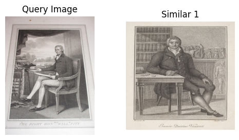
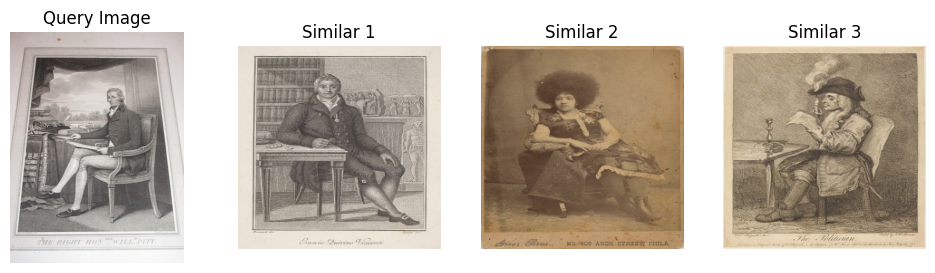
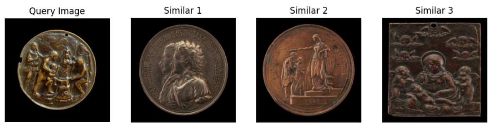

# Task 2: Painting Similarity 

## Discussion

The goal of this task is to build a model that identifies similarities in paintings, such as portraits with similar faces or poses. The **National Gallery of Art Open Dataset** served as the foundation for this experiment, providing a diverse collection of artworks for analysis. 

**DINO and ConvNeXt were employed for feature extraction**, capturing deep visual representations of paintings. The extracted features were systematically organized to ensure efficient retrieval. To facilitate structured storage, the features were saved in a **"feature" directory**, categorized into two subfolders: **"with_face"** for features extracted from detected faces using **MTCNN** (facenet-pytorch) and **"without_face"** for features extracted from the entire painting. Each extracted feature was stored in **NumPy (.npy) format**, enabling quick loading and reducing computational overhead during similarity search. 

**Due to hardware constraints, feature extraction and similarity search were conducted on a CPU machine**, which impacted processing speed but ensured that the approach remained feasible within available resources. The model utilizes these pre-extracted features, allowing for **rapid similarity retrieval without requiring real-time feature extraction**. This structured approach ensures efficiency in handling large datasets while maintaining retrieval accuracy.


## Implementation

### **1. Dataset Preparation**
The dataset was first downloaded and stored in a designated folder. To standardize the input, all images were **resized to 224x224 pixels** before feature extraction.

### **2. Feature Extraction and Storage**
Feature extraction was performed using **DINO and ConvNeXt**, capturing deep representations of paintings. To enhance efficiency, extracted features were stored in `.npy` format within a structured directory. The storage structure included two subfolders:  
- **"with_face"** – Features extracted from detected faces using **MTCNN** (facenet-pytorch).  
- **"without_face"** – Features extracted from the entire painting.

A script named `extract_feature.py` was used to automate the extraction and save the features for quick access. **Only 500 images were selected for feature extraction and image retrieval**, ensuring computational feasibility without processing the entire dataset.

### **3. Image Retrieval**
A dedicated **Image Retrieval** module was implemented to find visually similar paintings based on extracted features. Users could specify the feature extraction model (`DINO` or `ConvNeXt`) and whether to use face-based features. The retrieval process involved computing **cosine similarity** between the query image and stored features. The retrieval process was executed as follows:

```python
from utils.image_retrival import ImageRetrieval

retrieval = ImageRetrieval(feature_dir=feature_dir, model_name="dino", use_face=False)

results = retrieval.find_similar_images(query_image, k=3)

print("Similar Images:", results)
```
### **4. Visualization**
To better understand how paintings were grouped based on their extracted features, **t-SNE** visualizations were generated using the `visualize.py` script. This provided an intuitive representation of the clustering patterns formed by the model.

The t-SNE maps helped in analyzing whether similar paintings were correctly placed close to each other in the feature space, validating the effectiveness of the **DINO** and **ConvNeXt** feature extractors in capturing artistic similarities.


## How to Test the Model

To test the model on new images, follow these steps:

1. **Set Up the Environment**  
   Follow the environment setup instructions provided in the root `README.md` file.

2. **Open Task 2 Directory**  
   Navigate to the `task2` folder and open Jupyter Notebook.

3. **Run the Tutorial Notebook**  
   Open the `tutorial.ipynb` notebook and execute the cells one by one to load the model, preprocess the data, and run predictions.

## Results

The performance of the image retrieval system was evaluated by selecting **50 images** from the dataset's CSV file. These images were used as query images, and their **most similar counterparts were retrieved** using the implemented retrieval model.

### **Results on a Random Query Image from Web and Dataset**

#### **Query Image from the Web**
The following results show the retrieved images for a randomly selected **query image from the web**.

- **Query Image:**
  

- **Retrieved Similar Images:**
  

#### **Query Image from Dataset**
The results below demonstrate the retrieval performance for a **query image from the dataset**.

- **Query Image and Retrieved Similar Images:**
  


### **Evaluation Process**
- The last **50 images** from the CSV file were used for similarity retrieval.
- Retrieved images were compared with query images using **Structural Similarity Index (SSIM)**.
- The **average SSIM score** was computed for **ConvNeXt** and **DINO** feature extractors.

### **Average Similarity Scores**
| Model      | Average SSIM |
|------------|-------------|
| **ConvNeXt** | **0.2045** |
| **DINO**     | **0.2045** |

**Note:** Another metric, **Learned Perceptual Image Patch Similarity (LPIPS)**, can be used in future work. Unlike SSIM, LPIPS leverages deep learning models (e.g., **AlexNet**) to measure perceptual differences in feature space rather than pixel space, making it more aligned with human visual perception.

#### **t-SNE Visualization of Feature Space**
A **t-SNE map** was generated to visualize the feature distribution of images extracted using both models.


## **Conclusion and Future Work**

In this task, we explored the effectiveness of **DINO and ConvNeXt** for image retrieval in paintings. The **face-based retrieval model struggled to detect and extract faces** from paintings accurately, affecting its performance. A potential improvement could involve **fine-tuning MTCNN on a dataset of painted faces** to enhance face detection in artistic works.

Additionally, **FAISS (Facebook AI Similarity Search)** could be integrated to enable **fast retrieval on large datasets**, improving efficiency when scaling up the system.

### **Future Work**
- **Fine-tune MTCNN** on painting-specific face datasets for better facial retrieval.
- **Implement FAISS** to improve retrieval speed on larger datasets.
- **Experiment with different feature fusion techniques** to combine face and global image embeddings.

---

🎨 **Note:** *I thoroughly enjoyed this task and gained valuable insights into image retrieval techniques!* 🚀😃

